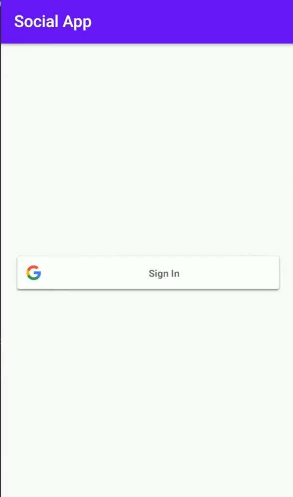
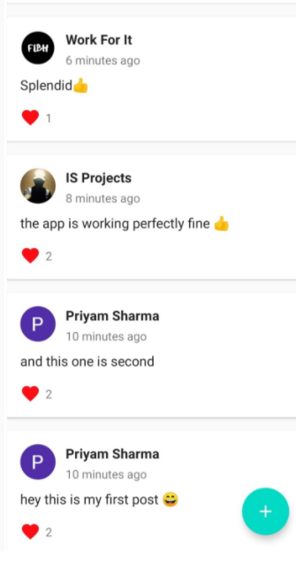

# Social-Media-App

# This is a social media app which allows users to :- 

❓ Login using Google Authentication

❓ Make a post

❓ Set Profile Picture

❓ Display time of the post

❓ Display creator of the post

❓ Like the post 

❓ Realtime Updation of Likes of the post

# This app uses a similar architecture to the [***MVVM (Model View View-Model)***](https://developer.android.com/jetpack/docs/guide#recommended-app-arch) architecture.

# 1. Google Authentication on new user sign up:

 

 

# 2.Make a Post:

 

 

# 3. All posts by different users and likes updation in realtime:

 

 

